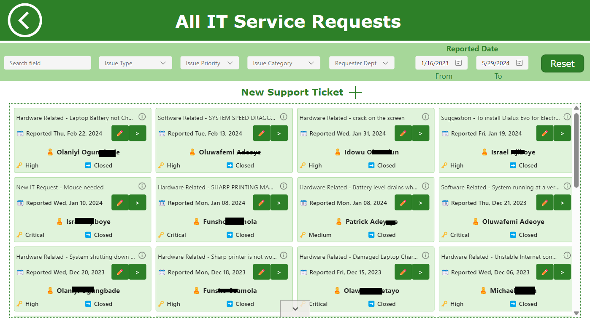
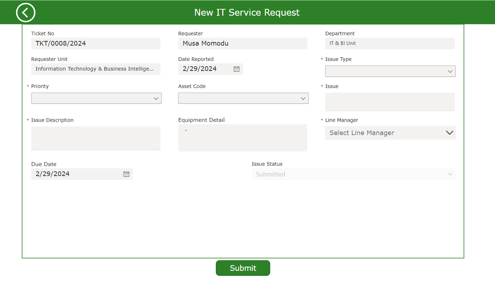
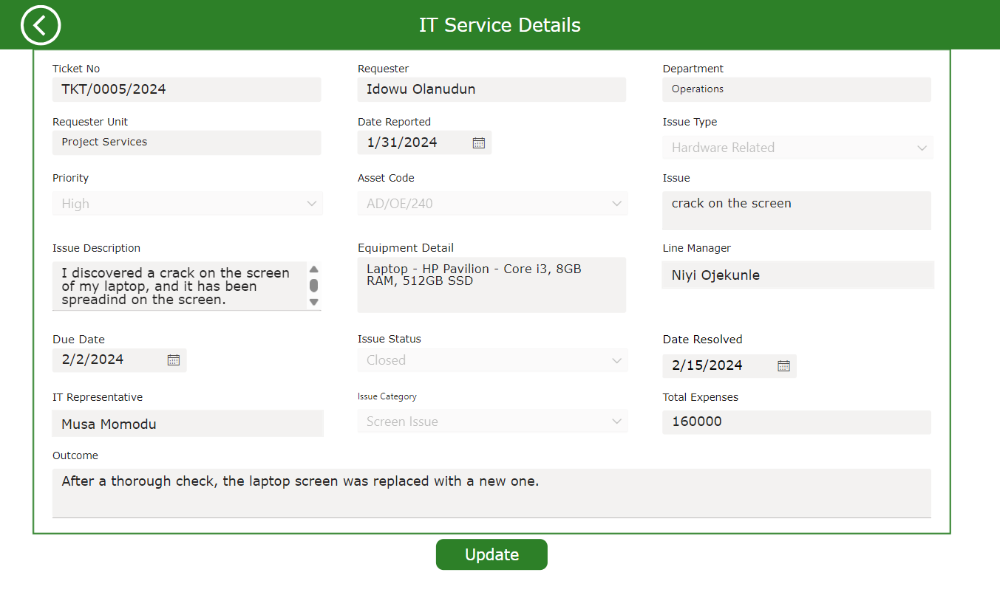
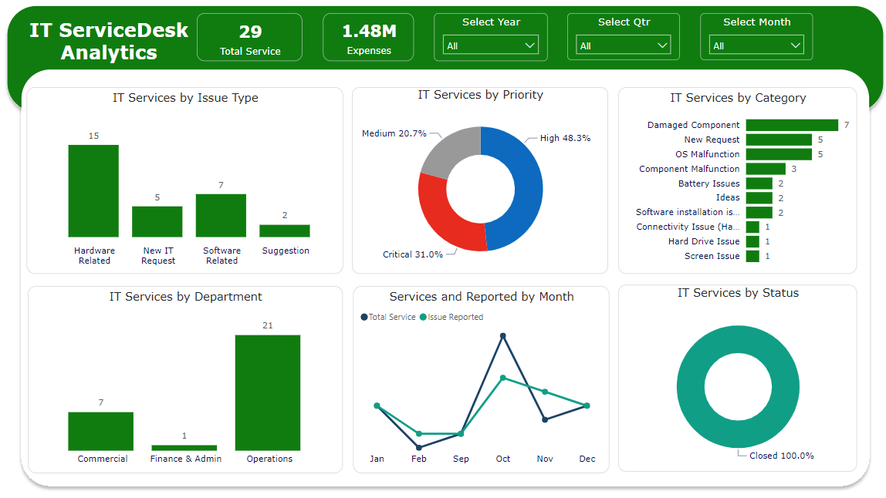
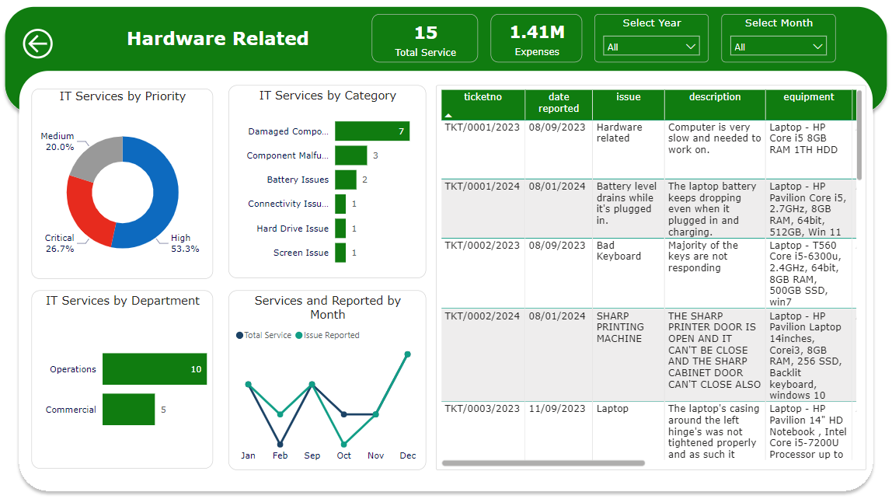

# IT-Service-Desk-Application

## 1. Introduction

### 1.1 Overview
The IT Service Desk Application, built using Microsoft Power Platform tools, offers a centralized platform for employees to seek assistance and support with their information technology-related issues and inquiries. Our goal is to streamline your IT support experience by simplifying the process of seeking help and finding solutions for your IT queries. Through this platform, you can conveniently access all technology-related issues with just a click.

We've implemented a ticket submission process that allows you to provide detailed information about your issues. This ensures that we have all the necessary details to promptly assist you. Stay informed throughout the resolution process with real-time updates that allow you to track the progress of your issues.
### 1.2 Key Features
- **Ticket Management**: Create, track, and resolve incidents and service requests through a structured ticketing system.
- **Self-Service and Service Catalog**: Empower users with self-help options and an integrated service catalog.
- **Timely Notifications**: The system sends notifications to relevant parties (such as managers and employees) at various stages of the Appraisal,and Objective setting process, ensuring everyone stays informed.
- **Asset Management:**: Efficiently track and manage IT assets, including hardware, software, and licenses.
- **Knowledge Base Management**: Maintain a repository of solutions, best practices, and troubleshooting guides.
- **Dashboards and Analytics**: Visualize performance metrics, trends, and insights to make informed decisions.

# 2.0 Details
## 2.1 Skill Demonstrated
- Database:The application’s data structure relies on Microsoft Dataverse Tables for organizing data, establishing relationships, and connecting to the app.
Alternatively, SharePoint or SQL Server can serve the same purpose, but consistent field name maintenance is essential.
- PowerApps: We utilize PowerApps to design a customized user interface.
Its adaptable design features allow us to create intuitive and personalized experiences for end-users.
- Power Automate: Implemented to optimize and automate approval procedures within the application development framework.
It enhances workflow administration and promotes collaboration among team members.
- Power BI: Employed for crafting visual representations that provide deep insights and analytical perspectives.
These insights cover various aspects of documents, including usage patterns, access history, and performance metrics. 

### 2.2 User Roles and Controls
Three distinct roles have been delineated within the application: super admin, editor, and viewer.
- Super Admin: The super admin possesses extensive privileges, allowing them to create, update, read, and delete not only their own record but also all accessible records throughout the application.
- Editor: Editors can create, edit, and update their own records.
- Viewer: Viewers have limited access and can only browse records for which they have explicit permission.

## 3. App Interface

### 3.1 Main Page

### 3.2 Service Request

#### 3.2.1 New Objective & Goals Setting

New Request Screen | Completed Request Screen
:------------------:|:---------------------:
   | 

### 3.3 Analytics
Overview Screen | Detailed Screen
:------------------:|:---------------------:
   | 

